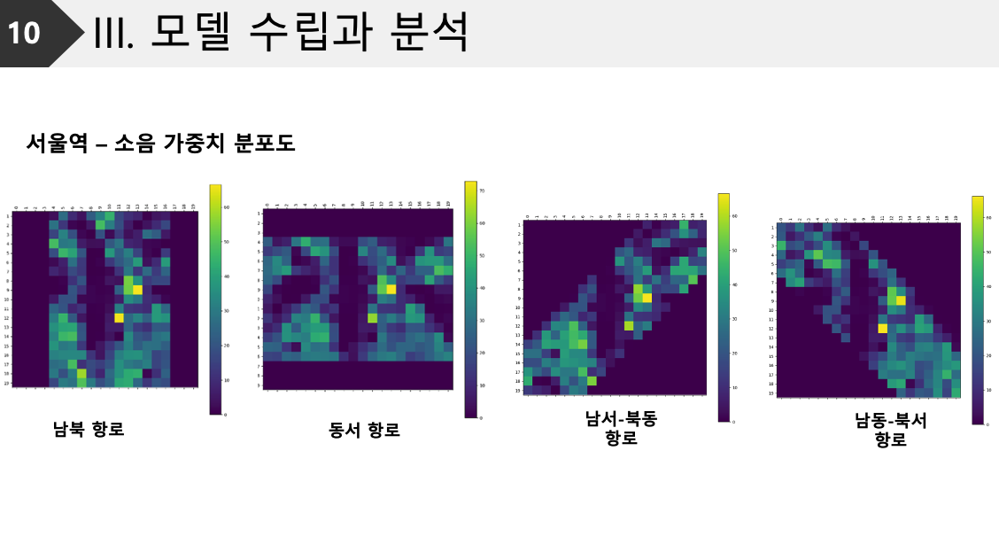

## 2024 국토·교통 데이터활용 경진대회
국토교통부 주최
Ministry of Land, Infrastructure and Transport Data Utilization Contest 
https://www.bigdata-transportation.kr/pageant/dashboard/CMPE_000000000020020

## UAM 항로설계 소음분석 모델

## 1. 광역교통수요 분석
-이용데이터

- 분석 흐름
  - 이용객이 제일 많은 지점(역, 정류장, 환승센터 등)
  - 해당 지점에서 이용객이 제일 많은 노선
  - 해당 노선에서 승하차량이 제일 많은 지역
  

- 상위_15개_승차하차_역별_승객수
  

## 2. 지구분석
- 이용데이터
- 분석흐름
  - 광역교통수요 분석 결과를 기준으로 지구분석 시행
  - 지적편집도, 부동산 데이터 기반으로 특정비율을 기준으로 상업, 주거지역 구분
  - 6개 지역에 대해 고도정보 맵핑(이착륙 항로 제약조건 설정을 위함)
- 원하는 결과
  - 이착륙장 반경 250m 길이 기준, 그리드 사이즈 25 x 25격자화
  - 해당 격자에 대하여 격자별 지구 유형 매핑
  - 해당 격자별 고도정보 매핑
    

## 3. 고도에 따른 소음의 상관관계 회귀 분석
- 이용데이터
- 분석흐름
  - 계기접근 차트와 항공소음지도를 기반으로 각 측정지점의 고도와 소음데이터 추출
  - 선형회귀 모델 작성
  - 선형회귀 분석 후 선형적으로 fit한 곡선 추출
  - 이후 거리에 따른 대략적인 소음값 산출
  - 이때 기체 엔진 데이터는 B737 또는 A320F 기종을 대상으로 함(국내선 최다 운항 항공기)
- 원하는 결과
  - 선형회귀 그래프 최종산출 데이터
    
    
1) 분석 대상 항공기 기준거리 평균 소음 산출
EASA data에서 A320, B737 항공기의 Approach 단계 소음평균 계산 python code
  [avg_noise](codes/avg_noise.py)

  
기준고도 120m에서의 두 항공기의 평균 소음
- A320: 93.948 Epn dB (측정횟수: 2,708회)
- B737: 96.235 Epn dB (측정횟수: 1,589회)
    
2) 위 데이터의 유효성 확인(왜, A320F, B737들로만 엔진소음 분석을 시행하는가?)
  [checking](codes/checking.py)

  

  
    
3) 실시간 소음데이터 추출
  [livenoise](codes/livenoise.py)
- 30분동안 약 480여개의 데이터 투출
- 목표데이터 최소 8천개 이상
- 토요일, 일요일 양일간 1300i~1900i 6시간동안 데이터 추출할것
  → 예상 데이터 수량 10,800개

## 분석과정
  

## 분석
  

  

## 사용 데이터 목록
  
- 국토교통부 데이터 통합채널
https://data.molit.go.kr

- 국가교통 데이터 오픈마켓
https://bigdata-transportation.kr/

- 항공기 소음포털(한국공항공사)
https://www.airportnoise.kr/anps/guide/Area

- 국토교통부_정류장별_이용량_현황 / 교통카드 빅데이터 통합정보시스템
https://www.data.go.kr/data/15071607/fileData.do?recommendDataYn=Y

- 국토교통부_용도별건물정보(반기) / 국토교통부 V-World

- 용도별건물정보 / 국토교통부 V-World

- Geocoder API 2.0 레퍼런스 / 국토교통부 V-World

- 실시간 김포공항 소음측정 정보 / 한국공항공사

- 항공기 출도착현황 / 한국공항공사

- 김포공항(RKSS) 항로정보 / 항공정보포털 AIM

- 항공기소음 측정 운영지침 / 국가법령정보센터

- 소음ㆍ진동관리법 / 국가법령정보센터

## appendix

## TEAM UAIN 팀 구성
| 역할   | 이름     | 설명                                                                                                                                                                                                                           |
|--------|----------|----------------------------------------------------------------------------------------------------------------------------------------------------------------------------------------------------------------------------------|
| 팀장   | 김지훈   | 인하대 스마트 모빌리티공학과, 항공우주공학과 (부)|
| 팀원    | 이현서   | 인하대 컴퓨터공학과, 학부연구생(컴퓨터비전 영상처리 머신러닝 분야) |

